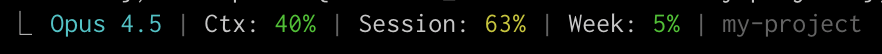

<h1 align="center">claude-code-statusline</h1>

<p align="center">
  <strong>Real-time subscription usage monitoring for Claude Code</strong>
</p>

<p align="center">
  <a href="LICENSE"></a>
  
  
  
  <br>
  <a href="README.md"></a>
  <a href="README.ko.md"></a>
  <a href="README.ja.md"></a>
</p>

<p align="center">
  Displays your Claude Max/Pro subscription usage directly in the status line.<br>
  Session limits, weekly caps, and context window — all visible at a glance.
</p>

<p align="center">
  
</p>

---

## The Problem

Claude Code's `/usage` command shows your subscription limits, but:

- **Invisible during work** — you have to stop and type `/usage` to check
- **No warning before hitting limits** — you find out you're rate-limited only after a failed request
- **Context blindness** — no idea how close you are to compaction until it happens

## The Solution

`claude-code-statusline` puts usage data where you can always see it:

```
  Opus 4.5 | Ctx: 44% | Session: 77% (10:59pm) | Week: All 7% / Sonnet 1% (Jan17 5:59pm)
  ────────   ────────   ──────────────────────   ─────────────────────────────────────────
  Model      Context    5-hour cycle with        7-day cap (all models + Sonnet breakdown)
             window %   reset time               with reset time
```

Color-coded thresholds change as you approach limits — green → yellow → red.

## Quick Start

```bash
# Download
curl -o ~/.claude/statusline-command.sh \
  https://raw.githubusercontent.com/Canto87/claude-code-statusline/main/statusline-command.sh

# Make executable
chmod +x ~/.claude/statusline-command.sh
```

Add to `~/.claude/settings.json`:

```json
{
  "statusLine": {
    "type": "command",
    "command": "~/.claude/statusline-command.sh"
  }
}
```

> **Requirements:** macOS, `jq`, `curl`, Claude Code with Pro/Max subscription

## How It Works

```
  Claude Code runs status line command
       │
       ▼
  Read OAuth token from macOS Keychain
       │
       ▼
  GET /api/oauth/usage ──► Cache response (60s TTL)
       │
       ▼
  Parse utilization % + reset times
       │
       ▼
  Format with ANSI colors ──► Display in status line
```

The script calls the same API that `/usage` uses internally:

```
GET https://api.anthropic.com/api/oauth/usage
Authorization: Bearer <oauth_token>
```

The OAuth token is read from macOS Keychain where Claude Code stores it. No manual token configuration needed.

## Output Format

| Field | Description | Color Thresholds |
|:------|:------------|:-----------------|
| Model | Current Claude model | Cyan (always) |
| Ctx | Context window usage % | 🟢 <50% · 🟡 50-79% · 🔴 80%+ |
| Session | 5-hour cycle usage with reset time | 🟢 <50% · 🟡 50-79% · 🔴 80%+ |
| Week All | 7-day usage across all models | 🟢 <50% · 🟡 50-79% · 🔴 80%+ |
| Week Sonnet | 7-day Sonnet-specific usage with reset time | 🟢 <50% · 🟡 50-79% · 🔴 80%+ |

When the API fetch fails (e.g., expired token, network issue), the status line shows `Usage: API Error` instead of misleading 0% values.

## Customization

### Cache Duration

Edit `CACHE_MAX_AGE` in the script (default: 60 seconds):

```bash
CACHE_MAX_AGE=120  # 2 minutes
```

### Color Thresholds

Edit the `select_color` function:

```bash
select_color() {
    local pct=$1
    if [ "$pct" -ge 90 ]; then    # Red at 90%+
        echo "$RED"
    elif [ "$pct" -ge 70 ]; then  # Yellow at 70%+
        echo "$YELLOW"
    else
        echo "$GREEN"
    fi
}
```

## Troubleshooting

### Status line not showing

Test the script directly:

```bash
echo '{}' | ~/.claude/statusline-command.sh
```

### Usage shows "API Error"

Check if the OAuth token is accessible:

```bash
security find-generic-password -s "Claude Code-credentials" -w | jq '.claudeAiOauth.accessToken' | head -c 20
```

If empty, re-login with `/login` in Claude Code.

### Usage always shows 0%

Delete the stale cache and retry:

```bash
rm ~/.claude/usage-cache.json
```

## License

[MIT](LICENSE)
